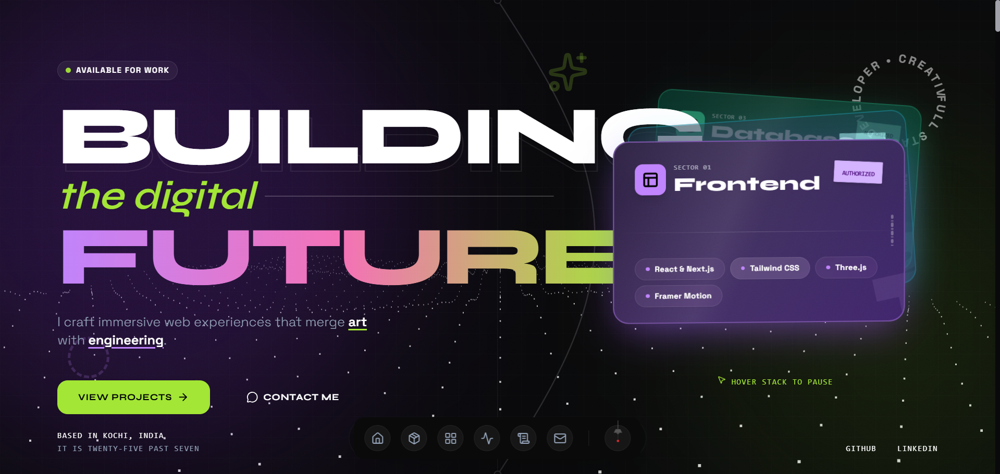

# ⚡ Personal Portfolio Website

> **A high-performance, immersive digital experience bridging creative design and modern engineering.**



## 📌 Overview

This project is a **production-ready personal portfolio** built to demonstrate the capabilities of the modern web. It moves beyond static templates, utilizing **3D physics**, **complex typography**, and **fluid animations** to create a memorable narrative experience.

Designed with a **"Cyber-Industrial"** aesthetic, it features a unique **Lime & Purple** neon theme, glassmorphic interfaces, and a custom-built 3D card stack. It is fully optimized for **SEO**, **Accessibility**, and **Performance**, scoring high on Core Web Vitals.

---

## ✨ Key Features

### 🎨 Visual & Interactive Design
- **3D Hero Stack**: A physics-based, interactive card stack built with **React Three Fiber** and populated dynamically from `skills.tsx`. Users can drag, toss, and interact with project cards in 3D space.
- **Cyber-Industrial Theme**: A cohesive design system using **Tailwind CSS**, featuring liquid glass effects, noise textures, and vibrant neon accents (Lime/Purple).
- **S-Curve Narrative**: A unique SVG-based scroll visualization that guides the user through the page with a glowing, theme-aware path.
- **Dynamic Typography**: A bold pairing of **Syne** (Display/Outline) and **Space Grotesk** (Body) fonts, fully optimized for web.
- **Natural Language Time**: A custom "Qlocktwo-style" word-based clock implementation (e.g., "it is ten past five") that updates in real-time without layout shifts.

### ⚡ Performance & Core
- **Next.js 16 (App Router)**: Built on the latest React Server Components architecture for instant page loads and optimal SEO.
- **React 19**: Leveraging the latest concurrent features and actions.
- **Mobile-First**: Fully responsive layouts with touch-optimized 3D interactions and adaptive typography.
- **Zero-Layout Shift**: Strict image sizing and font preloading to ensure a stable CLS score.

### 🛠 Functional Integrations
- **Secure Contact Form**: Server-side handling via **Resend API** with internal rate limiting, input validation, and real-time status feedback.
- **Project Deep-Dives**: A dedicated modal system for detailed project case studies, featuring "sticker" styling and rich content support.
- **Theme Engine**: Robust dark/light mode implementation (defaulting to a premium dark aesthetic).

---

## 🏗️ Technical Architecture

This project is not just a UI showcase; it's engineered for maintainability and scale.

| Category | Technology | Reasoning |
|----------|------------|-----------|
| **Core** | [Next.js 16](https://nextjs.org/) | App Router, Server Components, Image Optimization |
| **UI Library** | [React 19](https://react.dev/) | Component-based architecture, latest hooks |
| **Styling** | [Tailwind CSS](https://tailwindcss.com/) | Utility-first, design system tokens, maintainability |
| **Animation** | [Framer Motion](https://www.framer.com/motion/) | Complex layout transitions, scroll triggers |
| **Logic** | [Custom Hooks](src/hooks/) | Encapsulated logic for time approximation (`useTimeWords`) |
| **3D Engine** | [R3F (@react-three/fiber)](https://docs.pmnd.rs/react-three-fiber) | Declarative Three.js scene management |
| **Icons** | [Lucide React](https://lucide.dev/) | Consistent, lightweight SVG icon system |
| **Database** | [Supabase](https://supabase.com/) | Postgres database and authentication (replacing Firebase for key features) |
| **Email** | [Resend](https://resend.com/) | Reliable transactional email API |

---

## 🚀 Getting Started

Follow these steps to run the portfolio locally.

### Prerequisites
- **Node.js** 18.x or higher
- **npm** or **pnpm**

### Installation

1.  **Clone the repository:**
    ```bash
    git clone https://github.com/UmerRizwan03/MyPortfolio.git
    cd MyPortfolio
    ```

2.  **Install dependencies:**
    ```bash
    npm install
    # or
    pnpm install
    ```

3.  **Configure Environment:**
    Create a `.env.local` file in the root directory. You will need a **Resend API Key** for the contact form to function fully.

    ```env
    # Required for Contact Form
    RESEND_API_KEY=re_123456789...
    RESEND_FROM_EMAIL=onboarding@resend.dev
    RESEND_TO_EMAIL=your_actual_email@example.com
    ```

4.  **Run Development Server:**
    ```bash
    npm run dev
    ```
    Open [http://localhost:3000](http://localhost:3000) to view the site.

---

## 📂 Project Structure

```bash
/src
 ├── /app              # Next.js App Router (Pages & Layouts)
 │    ├── /api         # Serverless Functions (Email sending)
 │    ├── globals.css  # Global styles & Tailwind directives
 │    └── layout.tsx   # Root layout (Metadata, Fonts, Providers)
 ├── /components       # React Components
 │    ├── /ui          # Reusable UI primitives (GlassCard, Buttons)
 │    ├── HeroStack.tsx # 3D Interactive Hero
 │    ├── Projects.tsx # Project Grid & Modals
 │    └── ...
 ├── /contexts         # React Contexts (Section Observability)
 ├── /data             # Static Data Config (Skills, Projects)
 ├── /hooks            # Custom Hooks (useTimeWords, etc.)
 └── /lib              # Utilities (Class merging, Font configs)
```

---

## 🛡️ Linting & Quality

This project enforces strict code quality standards.

```bash
# Run ESLint
npm run lint
```
*Current Status: 0 Errors, Passing strict production audit.*

---

## 📄 License

This project is open source and available under the [MIT License](LICENSE).
